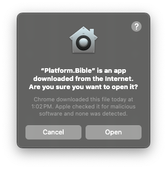

# Paranext

Build scripts to create a white-label application on Platform.Bible

<div align="center">
  
</div>

<div align="center">

[![Build Status][github-actions-status]][github-actions-url]
[![CodeQL][gitghub-codeql-status]][gitghub-codeql-url]
[![Github Tag][github-tag-image]][github-tag-url]

</div>

## Summary

Platform.Bible is an extensible Bible translation software. Its functionality is provided almost completely by extensions in order to be very powerful and flexible, giving developers the freedom to create and to share their desired Bible translation experience.

This repository only contains build scripts for creating a white-label application built on Platform.Bible. It does not contain the code for Platform.Bible or any [extensions](#extension-developers).

Note: Platform.Bible and its official releases are at [`paranext-core`](https://github.com/paranext/paranext-core). As this repository is currently configured, running these build scripts just creates a Platform.Bible application with the wrong version number and some additional sample extensions bundled in. You must fork this repository and configure it to your needs in order for it to do something useful.

## Users

This software is not yet ready for users. We'll update here with where you can install it when it is ready.

If you would still like to try Platform.Bible, you can [download early releases here on GitHub](https://github.com/paranext/paranext-core/releases).

### Linux Users

We can produce [`snap` packages](<https://en.wikipedia.org/wiki/Snap_(software)>) available [on the snap store](https://snapcraft.io/) for users to run our
software on Linux. Once you have all the `snap` tools installed for your flavor of Linux, run `sudo snap install <snap name>` or `sudo snap install <snap name> --channel=edge` for our most recent, pre-release build that has passed our limited, automated testing suite.

To install a locally created `snap` package, run the following commands:

```sh
sudo snap install <path to snap file> --dangerous
sudo snap connect <snap name>:dot-<snap name>
```

Some users may find that not everything works properly in Linux without some additional setup. Please see [How to set up Platform.Bible on Linux](https://github.com/paranext/paranext/wiki/How-to-set-up-Platform.Bible-on-Linux) for more information.

### Mac Users

If you download and run the ARM release of Platform.Bible from [a computer running Apple Silicon](https://support.apple.com/en-us/116943), you will likely encounter a warning from Apple's Gatekeeper stating that "Platform.Bible is an app downloaded from the Internet. Are you sure you want to open it?":



Don't be alarmed! This is a typical warning, seen when downloading most apps from the Internet. It also says "Apple checked it for malicious software and none was detected." If you trust Platform.Bible and would like to run it select "Open."

## Extension Developers

In addition to the [core extensions that are included with Platform.Bible](https://github.com/paranext/paranext-core/extensions), developers can create other extensions for use in Platform.Bible or any white-label product based on it. Extensions can either be bundled with a product or installed individually by users. Please see [Extension Template wiki](https://github.com/paranext/paranext-extension-template/wiki) for guides on developing additional extensions.

A white-label product based on Platform.Bible will typically include custom extensions beyond those bundled with Platform.Bible itself. To develop such extensions, you will need to make a separate repo with those extensions. See [Modifying productInfo.json](#modifying-productinfojson) for more information about bundling extensions into your product.

Extensions that are not bundled can be made available for users to install. See [Running your extension in an app](https://github.com/paranext/paranext-extension-template/wiki/Debugging-Your-Extension-in-the-Production-Application#running-your-extension-in-an-app) for installation information.

## Developer Install

_Note: The following development pre-requisite instructions are a duplicate of those found in [`paranext-core`'s Developer Install section](https://github.com/paranext/paranext-core?tab=readme-ov-file#developer-install). If you encounter issues, please refer to that section for the most up-to-date instructions on satisfying development prerequisites._

Set up prerequisites for building:

### Linux Development Prerequisites

Add the system libraries needed for Electron, [Build Instructions (Linux)](https://www.electronjs.org/docs/latest/development/build-instructions-linux).

### macOS Development Prerequisites

macOS doesn't come preinstalled with all the
[icu4c](https://unicode-org.github.io/icu/userguide/icu4c/) libraries. They must be
installed separately to provide Unicode support to our .NET code. Platform.Bible is
configured to expect those libraries to be installed using
[MacPorts](https://www.macports.org/) or [Homebrew](https://brew.sh/).

The build processes are configured to automatically download and package icu4c
libraries with the application, but for development this has to be done manually.

The .NET data provider is configured to automatically copy the icu4c `dylib`s into
its build output directory. If for some reason you need to disable that, you will
need to set an environment variable for the OS to find them. For example:

```bash
export DYLD_FALLBACK_LIBRARY_PATH="$HOME/lib:/usr/local/lib:/usr/lib:/opt/local/lib"
```

If you need to set environment variables like the above, consider adding them to
your `.zprofile` so you don't have to remember to do it manually.

#### Configuring ICU with MacPorts

Use the
[icu package on MacPorts](https://ports.macports.org/port/icu/).

#### Configuring ICU with Homebrew

Use the [icu4c package on Homebrew](https://formulae.brew.sh/formula/icu4c@77#default).

### All Platforms Development Prerequisites

Install [`Node.js` version >=18.0.0](https://nodejs.org/) (18.0.0 or greater is required for using `fetch`). We recommend using [Volta](#javascript-tool-manager).

Install `dotnet` [.NET 8 SDK from here](https://learn.microsoft.com/en-us/dotnet/core/install/).

To check if `dotnet` is installed run (ensure you have a v8 SDK):

```bash
dotnet --version
dotnet --list-sdks
```

### Cloning and installing dependencies (all platforms)

Clone the repo and install dependencies:

```bash
git clone https://github.com/paranext/paranext.git
cd paranext
npm install
```

## To update this respository from the template

This repository is forked from [`paranext`](https://github.com/paranext/paranext), which is periodically updated to reflect changes in [`Platform.Bible`](https://github.com/paranext/paranext-core) that affect white-labeling. We recommend you periodically update your repository by merging in the latest `paranext` template updates.

To set up this repository to be updated from the template, run the following command once after cloning it:

```bash
git remote add template https://github.com/paranext/paranext
```

To update this repository from the template, first make sure the current (checked-out) branch of your local repository has no working changes. Then run the following commands:

```bash
git fetch template
git merge template/main --allow-unrelated-histories
```

**Note:** The merge/squash commits created when updating this repository from the template are important; Git uses them to compare the files for future updates. If you edit this repository's Git history, please preserve these commits (do not squash them, for example) to avoid unnecessary merge conflicts in the future.

## Development

_Note: these instructions are for adjusting the application created by this repository that white-labels Platform.Bible. Please see [`paranext-core`](https://github.com/paranext/paranext-core) if you are looking to develop extensions on Platform.Bible._

This repository focuses primarily on modifying files found in a "core" repository containing Platform.Bible code as well as other repositories containing extensions for Platform.Bible then packaging them together to create an application that white-labels Platform.Bible and bundles in additional extensions.

**Warning: Building this application involves cloning and building multiple other repositories. This may take up to 5 GB (as of 7/23/24) of disk space total.**

### Preparing the repositories for patching

In order to prepare this repository for building your application or modifying the repositories involved in building your application, you must run the following command:

```bash
npm run reset-and-patch
```

This command clones the repositories involved in building your application into `temp-build` (if necessary), resets and pulls them to their latest revision (including deleting untracked files), and patches them with the patches contained in `repo-patches`. Once you run this command, you are ready to modify the repositories as desired.

Note: you can also run this command to reset the files in the repositories back to the latest saved repo patches if you [made modifications](#modifying-the-repo-patches) that you do not want to save.

### Modifying the build repositories

If you want to make edits to the repositories involved in building your application, you can do so in two ways:

#### Modifying `productInfo.json`

`productInfo.json` contains information about your application including which extension repositories to bundle into your application, values to replace in the "core" application like name and version, and more. Edit these values to adjust which repositories are involved in the build and how the final build comes out.

Note: if you change the repositories linked in your `productInfo.json`, you will need to [re-run `npm run reset-and-patch`](#preparing-the-repositories-for-patching) to clone the new repositories.

#### Modifying the repo patches

Each repository involved in building your application may be git patched in order to modify the contents of the repository to suit your needs. After [running `npm run reset-and-patch`](#preparing-the-repositories-for-patching), open their local clones in `temp-build` and make edits and new files as desired. You can optionally refer to values in `productInfo.json` by specifying `{{ productInfo.<key> }}` in the `temp-build` code, and it will be replaced with the appropriate value when [building the application](#building-the-application). See `temp-build/paranext-core/assets/localization/en.json` for an example.

Note: you can only refer to values that are direct keys of the top-level object in `productInfo.json` like `productInfo.productName`. You cannot refer to deeper values like `productInfo.build.coreRepo.uri` (please file an issue if you need to be able to do this). Also note you can refer to values that exist in `models/product-info.schema.json` but are not necessarily present in `productInfo.json` like `productInfo.name` because they are filled in if they are not present (see `lib/product-info.data.ts`). You can also specify additional properties not found in the schema like `productInfo.someOtherThing` and use them if desired.

### Save repo patches and build the application

Once you have adjusted `productInfo.json` to your liking and have made edits to the repos in `temp-build`, you can run the following command to save your repo patch changes (including untracked files):

```bash
npm run save-repo-patches
```

Alternatively, if you would like to save your repo patch changes and build the application (or if you just want to build the application after running [`npm run reset-and-patch`](#preparing-the-repositories-for-patching) without making any changes), you can run the following command to save and build:

```bash
npm run save-and-build
```

Note: due to the way the build scripts work, you must save repo patches before building to make sure you do not make unintentional changes to your patches. Alternatively, if you prefer to clear out all changes and untracked files since the patches were last saved and built, [you can do so by running different commands](#build-the-application-without-modifications).

## Build the application without modifications

If you do not want to do any development but just want to build the application without modifying the build in any way, you can run the following:

```bash
npm run build-ci
```

This will destroy [any changes and untracked files you have made to the repositories in `temp-build`](#modifying-the-repo-patches), so please be sure to do this only after saving or if you want to reset changes. This will also leave your `temp-build` folder in an in-between state that needs to be cleaned or reset. Please proceed to [run `npm run reset-and-patch`](#preparing-the-repositories-for-patching) if you want to modify the application or run the following command to clean out `temp-build` if you want to remove temporary build files completely:

```bash
npm run clean
```

This will also destroy [any changes and untracked files you have made to the repositories in `temp-build`](#modifying-the-repo-patches), so please be sure to do this only after saving or if you want to reset changes.

## Publishing

1. On each repository in your `productInfo.json`, create appropriate release branches.
2. Create a branch of the form `release/*`, e.g. `release/v1.2.3`, or `release/v1.2.3-rc1`.
3. Update the _version_ in your project's `package.json` (and `productInfo.json` if it has a separate version number), e.g.:
   ```bash
   npm version 1.2.3
   ```
4. Change the `branch` name for each repository in your `productInfo.json` to the branch, tag, or commit name of the release of that repository you want to include in the release for this product.
5. Create a new draft [GitHub **Release**](https://docs.github.com/en/repositories/releasing-projects-on-github/managing-releases-in-a-repository). Ensure the following are included:
   - a _Tag version_, e.g. `v1.2.3`, choose _Create new tag on publish_.
   - set the **Target** to the release branch.
   - a copy of the change log. Click **Generate release notes** as a starting point.
   - Click **Save draft**.
6. Update `CHANGELOG.md` with changes in this release from the GitHub draft **Release**.
7. Commit these changes to your release branch and push the commit to GitHub.
8. Once the GitHub build **Action** has finished, it will add build artifact files to the draft release. Remove the `.blockmap` files and leave the `.yml` files and the installers and executable, e.g. `.exe` on Windows.
9. Publish the release on GitHub.
10. Remove the branch name specifiers for each repository in your `productInfo.json` that you added in step 4.
11. Merge the release branch back into **main** with a merge commit.

## Troubleshooting

### Patches failing to apply: `error: while searching for ... ?`

If you run commands that patch the repositories and encounter an error like the following (`?` at the end of each line):

```
error: while searching for:
$color--platform-bible: #a70e13;?
$color--paratext-bible: #89ae26;?
?
$color--pt9-lightgreen: #b8d432;?
$color--pt9-darkgreen: #3f511e;?
$color--pt9-darkgray: #4c4c4c;?
?
$color--text: #191919;?
$color--text-dimmed: #aaa;?

error: patch failed: src/renderer/styles/_vars.scss:2
error: src/renderer/styles/_vars.scss: patch does not apply
```

This likely means you are on Windows and are encountering conflicts due to line ending differences. For these patches to succeed, you should be using LF line endings, not CRLF. Please ensure your patch files and all files they are targeting are using LF line endings, and try patching again.

### Failing to access private GitHub repositories in GitHub Actions

If your GitHub Actions are failing because they cannot access private GitHub repositories, you need to configure a fine-grained Personal Access Token with permissions to clone from the private GitHub repositories:

1. Create a new [fine-grained Personal Access Token](https://github.com/settings/tokens?type=beta) with the following Read permissions for the private repositories to clone ([source](https://stackoverflow.com/a/78280453)):

   - Commit statuses
   - Contents
   - Pull requests
   - Metadata

2. Add the new personal access token as a [Repository Secret](https://github.com/paranext/paranext/settings/secrets/actions) called `READ_REPOS_TOKEN`

### Git unexpectedly asks for GitHub credentials

If Git unexpectedly asks you for credentials while running builds, it is likely trying to clone private GitHub repositories via HTTPS which is not configured on your computer. You have a few options to resolve this issue:

- If it is not installed yet, [install `git-credential-manager`](https://github.com/git-ecosystem/git-credential-manager/blob/release/docs/install.md). Then, run the build again, and it will open a browser to the GitHub website for you to log in. The website will pass an authorization code to Git (OAuth). `git-credential-manager` comes bundled with Git in some installation methods.
  - We have not tested installing `git-credential-manager` _separately from Git_ and logging in with it, so please let us know if you try this method.
- Provide your username and a [personal access token](https://github.com/settings/personal-access-tokens) to Git.
- If you prefer to use SSH authentication with GitHub, you need to change the uris for the private repos in `productInfo.json` to point to the SSH uris for those repos.

### Windows installers are not signed by a certificate

If you want your Windows installer to be signed by a certificate so it is trusted by Windows, you need to obtain a certificate from a trusted certificate provider like [digicert](https://www.digicert.com/). If you use digicert specifically, then you can add the following secrets to your repo in GitHub and uncomment the [`Code signing - Windows` block in `publish.yml`](.github/workflows/publish.yml#L139):

- WIN_CERTIFICATE_SHA1_HASH
- WIN_CODE_SIGNING_CERT_HOST
- WIN_CODE_SIGNING_CERT_HOST_API_KEY
- WIN_CODE_SIGNING_CLIENT_CERT
- WIN_CODE_SIGNING_CLIENT_CERT_PASSWORD
- WIN_CODE_SIGNING_KEYPAIR_ALIAS

If you use a certificate provider other than digicert, you will need to add a step to your publishing workflow that handles the signing process used by that certificate provider. The commented out step in `publish.yml` will only work with digicert certificates.

## JavaScript Tool Manager

You can use [Volta](https://volta.sh/) with this repo to use the right version of tools such as **node** and **npm**.

If you don't use Volta just look at the `volta` property in [`package.json`](https://github.com/paranext/paranext/blob/main/package.json) to see the right tool versions to install in your preferred way.

## License

This project is licensed under the [MIT License](./LICENSE).
Copyright © 2022-2025 [SIL Global](https://www.sil.org/) and [United Bible Societies](https://unitedbiblesocieties.org/)

<!-- define variables used above -->

[github-actions-status]: https://github.com/paranext/paranext/workflows/Test/badge.svg
[github-actions-url]: https://github.com/paranext/paranext/actions
[gitghub-codeql-status]: https://github.com/paranext/paranext/actions/workflows/codeql-analysis.yml/badge.svg
[gitghub-codeql-url]: https://github.com/paranext/paranext/actions/workflows/codeql-analysis.yml
[github-tag-image]: https://img.shields.io/github/tag/paranext/paranext.svg?label=version
[github-tag-url]: https://github.com/paranext/paranext/releases/latest
